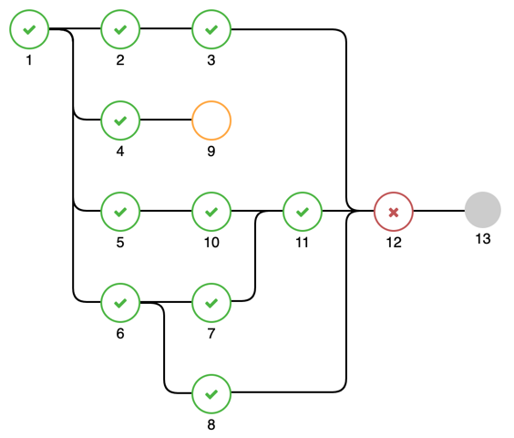

<p align="center" style="font-size: 2em">A javascript library for creating a</p> 
<p align="center" style="font-size: 2em">Multi Step Progress Bar</p>


## Description

The multi-step-progess-bar Library can be easily integrated into every frontend project, to create a progress bar with multiple steps.

Going a step further it is also possible to create simultaneous sub-processes. 

Under the hood, the library works with simple html and svg elements to create the progress bar.

## Example

<p align="center">
  
</p>

## Getting started

First create a ```div``` element in your HTML, which will be the parent of the progress bar.
```html
<body>
  <div id="container" class="container"></div>
</body>
```

Initialize the progress bar, by adding the following code to your JavaScript File.
```javascript
import ProgressBar from './modules/ProgressBar.js';

new ProgressBar({
    parent: document.getElementById('container'),
    style: {},
    initialNodes: [
        {
            id: '1',
            innerText: '1',
            outerText: 'first',
            isCompleted: true,
            isBeginningNode: true
        },
        {
            id: '2',
            innerText: '2',
            outerText: 'second',
            isCompleted: true,
            isBeginningNode: false,
            parentNode: '1'
        }
    ]
});
```

## Node Properties
A node can be initialized with the following properties.

| property        | description                                   | example    | type    | 
|-----------------|-----------------------------------------------|------------|---------|
| id              | Unique ID of the node                         | ```1```    | string  |
| innerText       | Text inside of the node                       | some text  | string  |
| outerText       | Text outside of the node                      | some text  | string  |
| parentNode      | ID of the parent node                         | ```1```    | string  |
| isActive        | Set node to active                            | ```true``` | boolean |
| isCompleted     | Set node to completed                         | ```true``` | boolean |
| isFailed        | Set node to failed                            | ```true``` | boolean |
| number          | Number of a node                              | ```1```    | integer |
| isBeginningNode | If the node should be a start node            | ```true``` | boolean |
| rowNumber       | The rowNumber can set the row of a start node | ```4```    | integer |


## Sub-Processes

Sub-Processes are automatically generated when two nodes have the same parent. 

## Style
The progress bar style can be adapted by using one of the following properties in the style object

| property           | description                             | default                                                                       | type      | 
|--------------------|-----------------------------------------|-------------------------------------------------------------------------------|-----------|
| showOuterText      | Show text outside of the node           | ```false```                                                                   | boolean   |
| nodeSize           | Size of a node in px                    | ```20```                                                                      | integer   |
| nodeDistanceX      | Horizontal distance between nodes in px | ```100```                                                                     | integer   |
| nodeDistanceY      | Vertical distance between nodes in px   | ```100```                                                                     | integer   |
| nodeColor          | Default Color of a node                 |  ```#cccccc``` | CSS color |
| nodeCompletedColor | Color of a completed node               |  ```#4bb543``` | CSS color |
| nodeActiveColor    | Color of an active node                 |  ```#ffa743``` | CSS color |
| nodeFailedColor    | Color of a failed node                  |  ```#c05555``` | CSS color |
| nodeStyle          | Set different node styles               | 0                                                                             | ```enum(0, 1)``` |


## Ideas & TODOs

- Loading Animation
- Node Details on Hover/Click


For any further ideas pleas write an E-Mail to <a href="mailto:l.adomat@reply.de">l.adomat@reply.de</a> or create a pull request.
